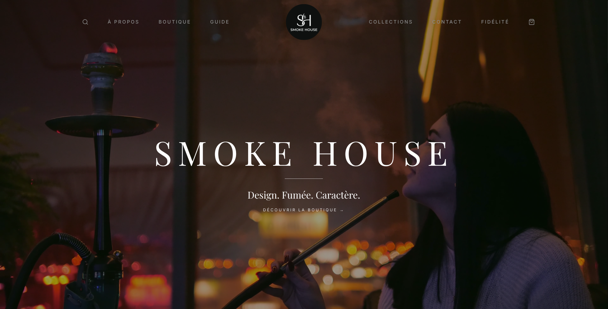

# SMOKE HOUSE — Premium Hookahs & Shisha Experience

An **exquisite, luxury hookah e-commerce experience** built with Next.js, Tailwind CSS, and TypeScript, featuring a sophisticated dark aesthetic, fluid GSAP scroll animations, and a meticulously crafted responsive design.

---

## Features

- Dynamic product grid with fluid horizontal swipe image previews when hovering over item cards
- Immersive storytelling sections with custom clip-path reveal animations mimicking an unfolding sheet effect
- Deep dark mode aesthetic utilizing rich neutral blacks and subtle crimson accents for a high-end luxury feel
- Advanced GSAP and ScrollTrigger choreography, featuring automated layout recalculations and responsive animation triggers
- Integrated global shopping cart context providing real-time item count badges and seamless cart management
- Bespoke typographic hierarchy combining Playfair Display for editorial elegance and Inter for sleek modern readability
- Fully responsive architecture — seamless transition from immersive desktop layouts to intuitive, touch-friendly mobile interfaces with swipe and trackpad support

---

## Technologies Used

- **Next.js 16 (App Router)** – React framework for optimized production, fast rendering, and routing
- **React 19** – Component-based UI architecture and hooks
- **TypeScript** – Strongly typed JavaScript for robust, error-free development
- **Tailwind CSS v4** – Utility-first styling for responsive layouts and bespoke luxury design tokens
- **GSAP 3.15 + ScrollTrigger** – Advanced timeline choreography, fluid transitions, and scroll-bound animations
- **Custom Fonts** – Playfair Display (Serif) and Inter (Sans-serif) optimized via `next/font`

---

## Preview

